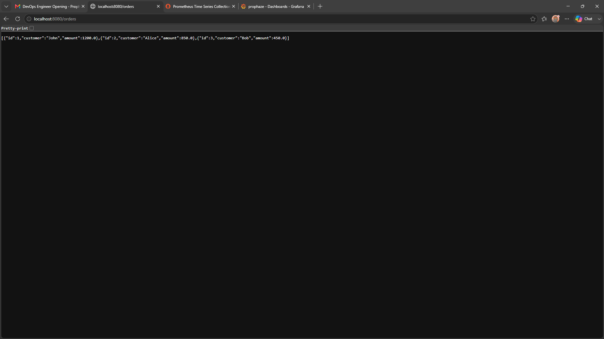
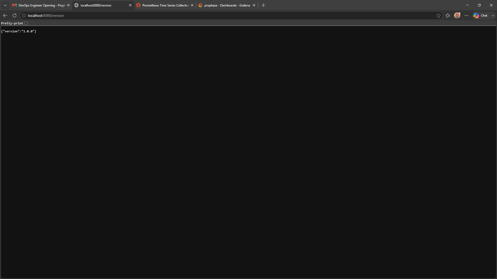
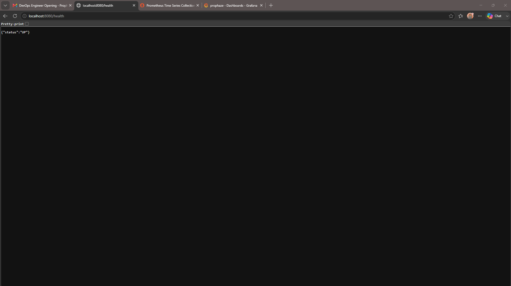
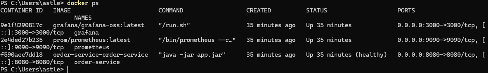
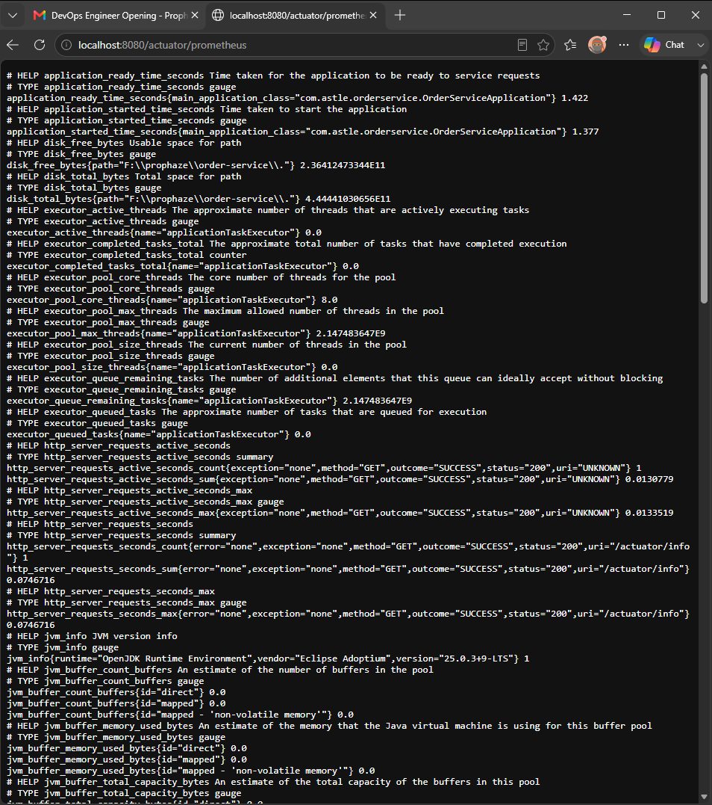
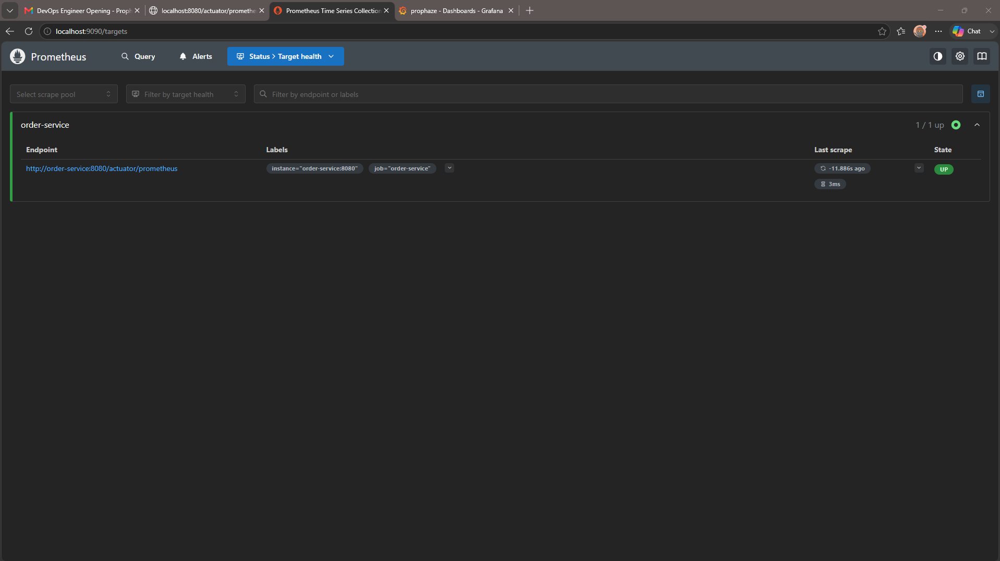
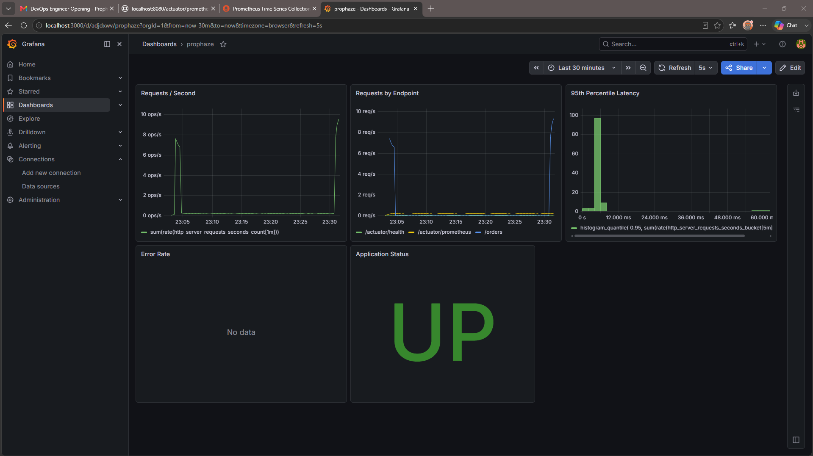
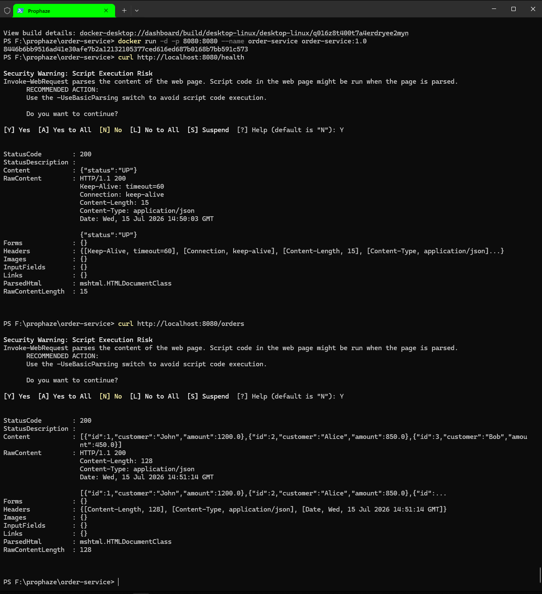

# Order Service - CI/CD + Observability with GitLab


A Spring Boot REST API demonstrating a complete CI/CD pipeline, containerization, Kubernetes deployment with Helm, and observability using Prometheus and Grafana.
# Screenshots

---

## API Endpoints

### Orders Endpoint



---

### Version Endpoint



---

### Health Endpoint



---

## Docker

Running containers



---

## Prometheus

### Metrics Endpoint



---

### Prometheus Target Status



---

## Grafana

Application dashboard



---

## Health Check using curl

Docker health verification



---

## Project Overview

This project was built as part of a DevOps machine test.

It demonstrates:

- Spring Boot REST API
- Docker containerization (non-root user + healthcheck)
- GitLab CI/CD pipeline with GitLab Shared Runners
- Maven build and unit testing
- Secret scanning using GitGuardian (GGShield)
- Vulnerability scanning using Trivy
- Docker image publishing to GitLab Container Registry
- Kubernetes deployment using Helm
- Prometheus metrics
- Grafana dashboard

---

# Architecture

```text
                    GitLab Repository
                           │
                           ▼
                    GitLab CI/CD Pipeline
                           │
        ┌──────────────────┴──────────────────┐
        │                                     │
 Secret Scan (ggshield)               Trivy Scan
        │                                     │
        └──────────────┬──────────────────────┘
                       ▼
                  Maven Build & Test
                       ▼
                Docker Image Build
                       ▼
                Push Image to Registry
                       ▼
               Helm Upgrade --install
                       ▼
              Kubernetes (dev namespace)
                       ▼
                Spring Boot Application
                       │
       /actuator/prometheus metrics
                       ▼
                  Prometheus Server
                       ▼
                    Grafana Dashboard
```

---

# Features

## REST API

| Endpoint | Description |
|----------|-------------|
| `/orders` | Returns sample order data |
| `/actuator/health` | Health endpoint |
| `/actuator/info` | Application version |
| `/actuator/prometheus` | Prometheus metrics |

---

## Docker

Features:

- Java 21
- Non-root user
- Healthcheck
- Small runtime image

Build image

```bash
docker build -t order-service .
```

Run container

```bash
docker run -d -p 8080:8080 order-service
```

Verify

```
http://localhost:8080/orders
```

---

# Local Development

Run locally

```bash
mvn spring-boot:run
```

Build

```bash
mvn clean package
```

Run tests

```bash
mvn test
```

---

# Helm Chart

The application is deployed using Helm.

Resources included:

- Deployment
- Service
- ServiceAccount
- Ingress
- Values.yaml
- Common helper templates

Validate chart

```bash
helm lint ./helm
```

Install

```bash
helm install order-service ./helm
```

Upgrade

```bash
helm upgrade --install order-service ./helm
```

---

# GitLab CI/CD Pipeline

Pipeline stages

```
scan
│
├── ggshield
└── Trivy
        │
build/test
        │
docker build
        │
image push
        │
deploy_dev (Helm)
        │
smoke_dev
```

Pipeline performs:

- Secret scanning using GitGuardian (GGShield)
- Maven dependency download
- Maven verification and unit testing
- Trivy filesystem vulnerability scanning
- Docker image build
- Push image to GitLab Container Registry
- Optional Helm deployment
- Optional smoke testing

```
# GitLab Container Registry

Docker images are automatically built and pushed by GitLab CI.

Example image:

```text
registry.gitlab.com/astle286/prophaze-machine-test:v1.0.0
---

# Observability

## Prometheus

Metrics exposed from

```
/actuator/prometheus
```

Prometheus scrapes metrics every 15 seconds.

---

## Grafana Dashboard

Dashboard includes

- Application Status
- Requests / Second
- 95th Percentile Latency
- Requests by Endpoint

---

# Project Structure

```
order-service
│
├── src
│   ├── main
│   └── test
│
├── helm
│   ├── Chart.yaml
│   ├── values.yaml
│   └── templates
│
├── prometheus
│   └── prometheus.yml
│
├── grafana
│   └── dashboard.json
│
├── Dockerfile
├── docker-compose.yml
├── .gitlab-ci.yml
├── pom.xml
└── README.md
```

---

# Technologies Used

- Java 21
- Spring Boot
- Maven
- Docker
- GitLab CI/CD
- Helm
- Kubernetes
- Prometheus
- Grafana
- GitGuardian (GGShield)
- Trivy

---


# Sample API Response

## GET /orders

```json
[
  {
    "id": 1,
    "customer": "John",
    "amount": 1200.0
  },
  {
    "id": 2,
    "customer": "Alice",
    "amount": 850.0
  },
  {
    "id": 3,
    "customer": "Bob",
    "amount": 450.0
  }
]
```
# Future Improvements

- Deploy to a remote Kubernetes cluster
- Self-hosted GitLab Runner on Kubernetes
- Automated deployment after successful image push
- Container image vulnerability scanning using `trivy image`
- Ingress with TLS
- Horizontal Pod Autoscaler
- Argo CD for GitOps deployments
---

# Bonus

NGINX Ingress rate limiting is configured using annotations:

```yaml
nginx.ingress.kubernetes.io/limit-rps: "10"
nginx.ingress.kubernetes.io/limit-burst-multiplier: "2"
```


---

# Author

**ASTLE E M**